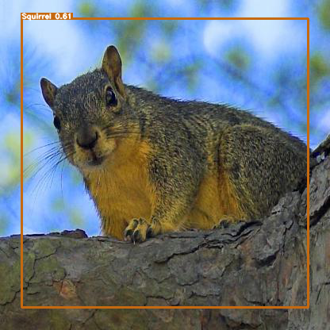
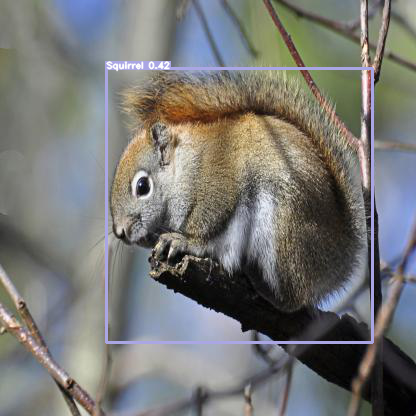
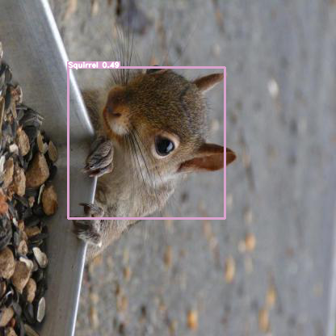
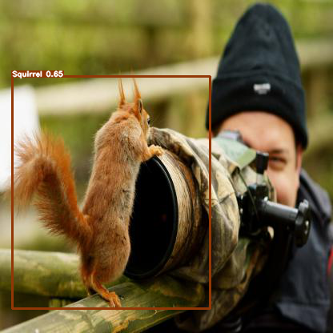

# Squirrel Detector - YOLOv4

This repository contains a Squirrel Object Detection model and weights.  
The model is built on a Keras implementation of YOLOv4 written by [taipingeric](https://github.com/taipingeric/yolo-v4-tf.keras).  
This repository is NOT a training tutorial, its is a functional pretrained object detector.








---

## Installation

A requirements.txt file has been provided.  
Once the repository has been cloned, create a new conda environment:

```bash
cd SquirrelDetector
conda create env --name squirreldet --file requirements.txt
conda activate squirreldet
```

---

## Usage

Run inference from the command line:  

```bash
python predict.py --input INPUT_PATH 
```
